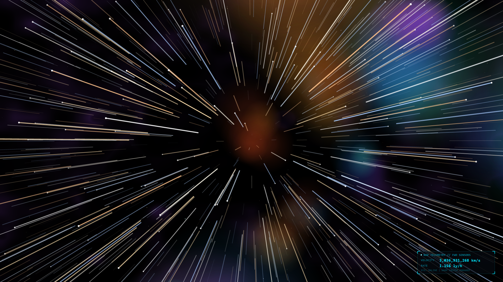
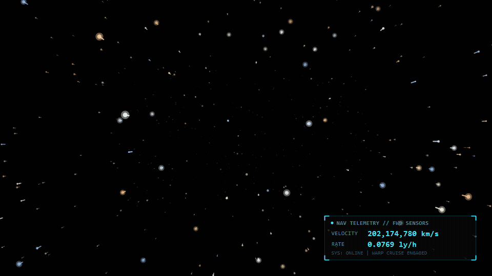
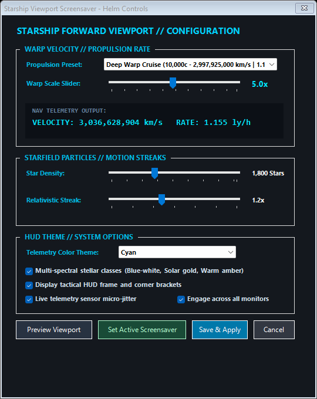

# 🚀 Starship Forward Viewport Screensaver

[](https://github.com/jiludkumar-therealone/starship-viewport)
[](https://github.com/jiludkumar-therealone/starship-viewport)
[-brightgreen)](https://github.com/jiludkumar-therealone/starship-viewport)
[](LICENSE)

Born out of pure nostalgia for the classic Windows 3D Starfield screensaver, **Starship Forward Viewport** is a Windows screensaver (`.scr`) that transforms your display into the forward viewing screen of an interstellar starship accelerating through deep space. Features true 3D perspective projection, relativistic warp streaks, and an authentic military-grade navigation telemetry HUD in the lower-right sector displaying velocity in **km/s** and interstellar rate in **lightyears/hour**.

---

## 🌌 Viewport Preview



```text
┌─ NAV TELEMETRY // FWD SENSORS ────────────────┐
│ VELOCITY    3,036,072,273 km/s                │
│ RATE        1.155 ly/h                        │
│ SYS: ONLINE | WARP CRUISE ENGAGED             │
└───────────────────────────────────────────────┘
```

### 🎬 Animated Warp Flight



---

## ⚡ Key Features

* **3D Perspective Starfield**: Deep space particles radiating forward with realistic depth-attenuated luminance.
* **Relativistic Warp Streaks**: Motion vectors stretch dynamically outwards based on forward velocity and proximity.
* **Spectral Stellar Classes**: Multi-spectral star generation across stellar classifications (Class O/B ice blue, Class A pure white, Class F warm ivory, Class G solar gold, Class K amber).
* **Tactical Navigation HUD**:
  * Real-time velocity readout in **km/s** (e.g. `3,036,072,273 km/s`).
  * Relativistic transit rate in **ly/h** (e.g. `1.155 ly/h`).
  * Micro-sensor telemetry jitter simulating active navigation sensors.
* **Helm Controls (Configuration Modal)**:
  * Speed slider with synchronized live calculation of km/s and ly/h.
  * Presets: Sub-light Impulse ($0.3c$), Light Speed ($1.0c$), Warp 3, Warp 5, Warp 8, Deep Warp ($10,000c$), and Slipstream ($50,000c$).
  * Fully persistent preset selection without reverting to defaults.
  * Particle density (400 to 4,500 stars).
  * 5 HUD Themes: Tactical Cyan, LCARS Amber, Starlight White, Emerald Green, Crimson Alert.
  * Multi-monitor span support.
* **Zero External Dependencies**: Compiles to a lightweight ~30 KB binary utilizing built-in Windows inbox components (.NET Framework / WinForms). Runs immediately on any stock Windows 10/11 installation out of the box without requiring external runtimes, C++ redistributables, or secondary installers.

---

## 🎛️ Helm Controls Interface



---

## 📥 Installation

> [!TIP]
> **Windows SmartScreen Notice**: Because this is a free, independent open-source project without an enterprise code-signing certificate, Microsoft Defender SmartScreen may display an *"Unrecognized app"* prompt on initial launch. Simply click **"More info"** → **"Run anyway"**, or unblock via PowerShell: `Unblock-File -Path .\StarshipStarfield.scr`. Alternatively, compile locally using `Build.ps1` (locally built binaries never trigger SmartScreen).

### Method 1: 1-Click Install (Pre-compiled Binary)
1. Download `StarshipStarfield.scr` from [GitHub Releases](https://github.com/jiludkumar-therealone/starship-viewport/releases).
2. Right-click `StarshipStarfield.scr` and click **Install**.
3. Windows Screen Saver Settings will open with the screensaver active and previewing in the mini monitor.

### Method 2: Automated PowerShell Script
Run `Install-Screensaver.ps1` or double-click `Install-Screensaver.bat`:
```powershell
.\Install-Screensaver.ps1
```
This registers `StarshipStarfield.scr` into your active user profile under `HKCU\Control Panel\Desktop\SCRNSAVE.EXE`.

### Command Line Switches
```cmd
StarshipStarfield.scr /s         :: Full-screen screensaver mode
StarshipStarfield.scr /c         :: Open Helm Controls / Settings dialog
StarshipStarfield.scr /p <HWND>  :: Render in child preview window
```

---

## 🔨 Building from Source

No Visual Studio or external .NET SDK installation is required—uses the built-in Windows .NET Framework compiler (`csc.exe`):

```powershell
git clone https://github.com/jiludkumar-therealone/starship-viewport.git
cd starship-viewport
.\Build.ps1 -Install
```

---

## 📜 License
MIT License. Free for personal and tactical use across all star systems.
